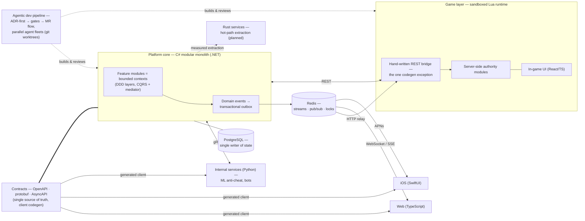

<p align="center">
  
</p>

<p align="center">
  <a href="README.md">🇬🇧 English</a> | <a href="README_RU.md">🇷🇺 Русский</a>
</p>

<p align="center">
  <i>Polyglot engineer. I build systems designed to outlive their first million lines.</i>
</p>

---

I pick the language after the problem, not before. Nearly eight years that started in Python now span C#/.NET, Rust, Go, TypeScript, Swift and Lua — what stays constant is the architecture: strict module boundaries, contract-first APIs, domain-driven design. I take on almost everything except gamedev itself — though game *servers* are very much my thing.

## Now

- Building **my own multiplayer game platform** — a C# modular monolith already past hundreds of thousands of lines → [details](#the-nda-project)
- Running a **multi-agent AI development pipeline** we designed from scratch — agent fleets in parallel across the team → [how it works](#ai-driven-development)
- Shipping **[yandex-music-streamdeck](https://github.com/Judd1zzz/yandex-music-streamdeck)** — a full Rust rewrite, live on two marketplaces → [below](#featured-yandex-music-for-stream-deck)

## Featured: Yandex Music for Stream Deck

[](https://github.com/Judd1zzz/yandex-music-streamdeck/releases) [](https://github.com/Judd1zzz/yandex-music-streamdeck/releases) [](https://github.com/Judd1zzz/yandex-music-streamdeck/stargazers) [](https://github.com/Judd1zzz/yandex-music-streamdeck/blob/main/LICENSE)

<p align="left">
  <a href="https://marketplace.elgato.com/product/yandex-music-integration-43741c24-1784-4492-be32-c631d7c55829"></a>
  <a href="https://space.key123.vip/product/20260706002752"></a>
</p>

Stream Deck / Stream Dock plugin for Yandex Music — a complete Rust port of my original Python version.

- **13 crates, hexagonal architecture** — tokio runtime, Chrome DevTools Protocol for player control, custom key rendering on tiny-skia
- **Distributed where users are**: [Elgato Marketplace](https://marketplace.elgato.com/product/yandex-music-integration-43741c24-1784-4492-be32-c631d7c55829), [Mirabox StreamDock Store](https://space.key123.vip/product/20260706002752) and [GitHub Releases](https://github.com/Judd1zzz/yandex-music-streamdeck/releases) — 500+ downloads
- **v2.0.0 “Rust Rewrite” → v2.3.0 in one week** (July 2026): six releases, the runtime cut down to a single binary

## The NDA project

> [!NOTE]
> This one is my own venture. The product ships under NDA, so there's no name and no code here; the architecture, though, is mine to design and mine to share.

A multiplayer game platform built as a **C# modular monolith** on .NET: every feature module is a bounded context with DDD layering, **CQRS with a mediator pipeline**, domain events, and a **transactional outbox**. **PostgreSQL** is the single writer of persistent state; **Redis** is the coordination fabric — streams for commands, pub/sub for notifications, locks and idempotency keys. Contracts come first: **OpenAPI, protobuf and AsyncAPI** definitions are the single source of truth, fanning out into generated clients for web (TypeScript), native iOS (SwiftUI) and internal Python services (ML anti-cheat, bots) over gRPC. Gameplay logic lives in a **sandboxed Lua scripting layer** behind a single **hand-written REST bridge** — the one deliberate exception to client codegen, because the game runtime speaks HTTP, not gRPC.

Today it spans **hundreds of thousands of lines** across a monorepo plus dedicated game-server and iOS/Android repositories on GitLab CI, and the roadmap points at **several million lines** with real infrastructure around it. The module boundaries are extraction-ready: hot paths — the exchange engine first — have a planned extraction path into **Rust services**, with seams clean enough that even the core could follow. A system this size is exactly why the development process itself had to be engineered (next section).

<details>
<summary><b>Architecture sketch (anonymized)</b></summary>



</details>

## AI-driven development

The most interesting thing we built this year isn't a service — it's a process. Together with my project partner, we designed and built **from scratch** a multi-agent development workflow where AI agents operate like a disciplined engineering organization rather than autocomplete — several engineers, each with their own fleet of agents, building one codebase in parallel:

- a **devkit** that routes every significant change through an **ADR** (architecture decision record) before any code is written
- **brain-check gates** — an agent must demonstrate correct understanding of the task, the module contracts and the constraints before it is allowed to proceed
- **merge-request flow** — agent-written, gate-checked, human-audited changes only
- **task-scoped parallelism** — one task = one issue = one branch = one git worktree = one agent, claimed before any work starts
- **agent teams × human team** — every engineer drives their own agents across parallel terminal sessions; claim-first coordination keeps entire fleets from colliding, so the process scales across people, not just within one machine

The orchestration, the gates and the conventions are our own design — born from running a codebase that no longer fits in one head, human or agent.

## Off-GitHub track record

Years of commercial work live in private repositories:

- **Payment gateway** — FastAPI, async SQLAlchemy 2, HMAC-signed webhooks, idempotency keys; Yookassa and self-employment tax service integrations
- **Game servers** — custom server-side logic and frameworks for RageMP and FiveM
- **Commercial full-stack** — warehouse management system on Next.js + FastAPI
- **Native iOS** — SwiftUI applications
- **Go microservices** (including an API) and a fleet of Discord/Telegram bots

## Tech stack

| | |
|---|---|
| **Languages** |        |
| **Backend & frameworks** |         |
| **Data & contracts** |       |
| **Infra & delivery** |      |

## Activity

<!--START_SECTION:waka-->
📊 **This Week I Spent My Time On** 

```text
💬 Programming Languages: 
Rust                     10 hrs 38 mins      ⣿⣿⣿⣿⣿⣿⣿⣿⣿⣀⣀⣀⣀⣀⣀⣀⣀⣀⣀⣀⣀⣀⣀⣀⣀   37.83 % 
Markdown                 10 hrs 24 mins      ⣿⣿⣿⣿⣿⣿⣿⣿⣿⣀⣀⣀⣀⣀⣀⣀⣀⣀⣀⣀⣀⣀⣀⣀⣀   36.98 % 
TypeScript               1 hr 24 mins        ⣿⣀⣀⣀⣀⣀⣀⣀⣀⣀⣀⣀⣀⣀⣀⣀⣀⣀⣀⣀⣀⣀⣀⣀⣀   05.01 % 
Text                     1 hr 2 mins         ⣿⣀⣀⣀⣀⣀⣀⣀⣀⣀⣀⣀⣀⣀⣀⣀⣀⣀⣀⣀⣀⣀⣀⣀⣀   03.72 % 
JavaScript               1 hr 1 min          ⣿⣀⣀⣀⣀⣀⣀⣀⣀⣀⣀⣀⣀⣀⣀⣀⣀⣀⣀⣀⣀⣀⣀⣀⣀   03.61 % 

💻 Operating System: 
Mac                      28 hrs 9 mins       ⣿⣿⣿⣿⣿⣿⣿⣿⣿⣿⣿⣿⣿⣿⣿⣿⣿⣿⣿⣿⣿⣿⣿⣿⣿   100.00 % 
```


<!--END_SECTION:waka-->

## Contact

Discord is the one channel I actually read:

[](https://discord.com/users/311568906307502090)
