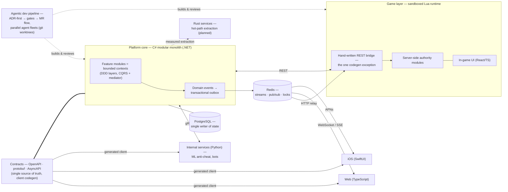

  

  <a href="README.md">🇬🇧 English</a> | <a href="README_RU.md">🇷🇺 Русский</a>

  <i>Инженер-полиглот. Строю системы, рассчитанные пережить свой первый миллион строк кода.</i>

---

Я выбираю язык под задачу, а не наоборот. Почти восемь лет, начавшихся с Python, теперь охватывают C#/.NET, Rust, Go, TypeScript, Swift и Lua — неизменной остаётся архитектура: жёсткие границы модулей, contract-first API, domain-driven design. Берусь почти за всё, кроме собственно геймдева — впрочем, игровые *серверы* как раз моя стихия.

## Сейчас

- Строю **собственную multiplayer-платформу** — модульный монолит на C#, уже перешагнувший сотни тысяч строк → [подробнее](#проект-под-nda)
- Развиваю **мультиагентный AI-пайплайн разработки**, который мы спроектировали с нуля, — параллельная работа групп агентов в рамках всей команды → [как это работает](#ai-driven-разработка)
- Выпускаю **[yandex-music-streamdeck](https://github.com/Judd1zzz/yandex-music-streamdeck)** — полный Rust-порт, доступен на двух маркетплейсах → [ниже](#featured-yandex-music-для-stream-deck)

## Featured: Yandex Music для Stream Deck

   

  
  

Плагин Stream Deck / Stream Dock для Яндекс Музыки — полный порт моей исходной Python-версии на Rust.

- **13 крейтов, гексагональная архитектура** — рантайм tokio, управление плеером через Chrome DevTools Protocol, собственный рендер клавиш на tiny-skia
- **Дистрибуция там, где пользователи**: [Elgato Marketplace](https://marketplace.elgato.com/product/yandex-music-integration-43741c24-1784-4492-be32-c631d7c55829), [StreamDock Store (Mirabox)](https://space.key123.vip/product/20260706002752) и [GitHub Releases](https://github.com/Judd1zzz/yandex-music-streamdeck/releases) — 500+ загрузок
- **v2.0.0 «Rust Rewrite» → v2.3.0 за одну неделю** (июль 2026): шесть релизов, рантайм ужат до единственного бинарника

## Проект под NDA

> [!NOTE]
> Это мой собственный проект. Продукт живёт под NDA, поэтому здесь нет ни названия, ни кода; но архитектура — мой дизайн, и делиться ею — моё решение как владельца.

Multiplayer-платформа, построенная как **модульный монолит на C#** (.NET): каждый функциональный модуль — bounded context с DDD-слоями, **CQRS через mediator-пайплайн**, доменными событиями и **transactional outbox**. **PostgreSQL** — единственный писатель персистентного состояния; **Redis** — координационная ткань: стримы для команд, pub/sub для уведомлений, локи и ключи идемпотентности. Контракты первичны: определения **OpenAPI, protobuf и AsyncAPI** — единственный источник правды, из которого кодогенерируются клиенты для веба (TypeScript), нативного iOS (SwiftUI) и внутренних Python-сервисов (ML-античит, боты) поверх gRPC. Игровая логика живёт в **изолированном Lua-слое** за единственным **рукописным REST-мостом** — осознанным исключением из кодогенерации: игровой рантайм говорит по HTTP, а не gRPC.

Сегодня это **сотни тысяч строк** в монорепо плюс отдельные репозитории игрового сервера и iOS/Android на GitLab CI, а road map ведёт к **нескольким миллионам строк** с настоящей инфраструктурой вокруг. Границы модулей готовы к извлечению: у "горячих" путей — первым движок биржи — запланирован путь выноса в **Rust-сервисы**, а швы настолько чистые, что за ними может последовать и само ядро. Система такого размера — ровно та причина, по которой сам процесс разработки пришлось проектировать как инженерную систему (следующая секция).

<b>Архитектурный набросок (обезличенный)</b>

## AI-driven разработка

Самое интересное, что мы построили в этом году, — не сервис, а процесс. Вместе с партнёром по проекту мы спроектировали и собрали **с нуля** мультиагентный workflow разработки, в котором AI-агенты работают как дисциплинированная и слаженная инженерная команда, а не как автодополнение, — несколько разработчиков, каждый со своей пачкой агентов, параллельно строят одну кодовую базу:

- **devkit**, который проводит каждое значимое изменение через **ADR** (architecture decision record) до того, как будет написана первая строка кода
- **brain-check-гейты** — агент обязан продемонстрировать верное понимание задачи, контрактов модулей и ограничений, прежде чем ему позволено продолжать
- **MR-флоу** — принимаются только изменения, написанные агентом, прошедшие гейты и проверенные человеком
- **задаче-центричный параллелизм** — одна задача = один issue = одна ветка = один git worktree = один агент, и задача закрепляется до начала работы
- **агентные команды × команда людей** — каждый разработчик ведёт своих агентов в параллельных терминальных сессиях; claim-first-координация не даёт целым группам сталкиваться, поэтому процесс масштабируется на людей, а не только внутри одной машины

Оркестрация, гейты и конвенции — наш собственный дизайн, рождённый из работы с кодовой базой, которая уже не помещается в одну голову — ни человеческую, ни агентную.

## Результаты работы вне GitHub

Годы коммерческой разработки живут в приватных репозиториях:

- **Платёжный шлюз** — FastAPI, асинхронный SQLAlchemy 2, HMAC-подписанные вебхуки, ключи идемпотентности; интеграции ЮKassa и «Мой налог»
- **Игровые серверы** — кастомная серверная логика и фреймворки для RageMP и FiveM
- **Коммерческий фулстек** — система управления складом на Next.js + FastAPI
- **Нативный iOS** — приложения на SwiftUI
- **Микросервисы на Go** (включая API) и огромная пачка Discord/Telegram-ботов

## Стек

| | |
|---|---|
| **Языки** |        |
| **Бэкенд и фреймворки** |         |
| **Данные и контракты** |       |
| **Инфраструктура и доставка** |      |

## Активность

> Автообновляемая статистика языков за неделю (WakaTime) — в [английской версии](README.md#activity).

## Связь

Discord — единственный канал, который я действительно читаю:

